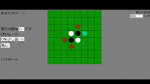

# オセロアプリ (作成日: 2022/2/27)

3つのモードで楽しめるオセロアプリです。

# DEMO



# 特徴

下記３種類のモードがあります。
* CPU(ランダム)

  * ランダムで駒を置くCPUと対戦できます。
* CPU(少し強い)
  * minimax法を使用したCPUと対戦できます。
* OFF
  * 両方の駒を操作できるモードです。

# インストール

```git
$ git clone https://github.com/furaidopoteto/OseroApp.git
```
上記コマンドでダウンロードし「Osero.html」ファイルを開くことで実行できます。

# 使用しているライブラリ

このプロジェクトでは、以下のライブラリを使用しています。

- [jQuery](https://jquery.com/) - JavaScriptのライブラリ (MIT License)
- [Icons8](https://icons8.jp/) - アイコンのフォント (CC BY-ND 3.0)

それぞれのライブラリについては、各ライブラリのウェブサイトをご参照ください。